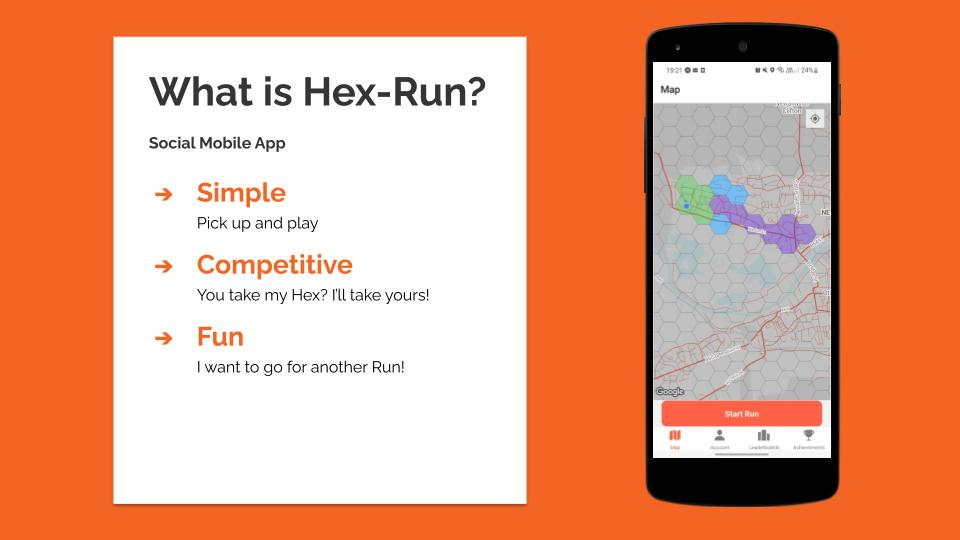

# **Hex-Run Team Project**

## **About**

The last couple of weeks at the Northcoders bootcamp was spent working on this app as part of my final project. Myself and three team members worked together to create a social mobile app designed to make exercise fun. It combines the background GPS locating, data visualisation and statistic tracking features of a serious fitness app like Strava with a hexagonal game board, allowing players to claim territory from others in real time simply by going for a run, while constantly working towards achievements to level up.

## **Technologies**

React Native + Expo
Turf.js
Firebase
Geolib
Victory Charts

# Setup

## **Requirements** 
Please install the latest version of [Node](https://nodejs.org/en/download/) 
The following version was used for this project.  
- `Node.js` v16.11.0

_To view your currently installed version of node use the following command:_

        $ node -v

To run Hex-Run on an Andorid or iOS device you will need to download the 'Expo' client from the relevant app store:
- Android - https://play.google.com/store/apps/details?id=host.exp.exponent 
- iOS - https://apps.apple.com/app/apple-store/id982107779 

## **Initial Setup**
1. Clone the project using the command below:

        $ git clone https://github.com/Iznara/Hex-Run.git

2. Navigate to the cloned repository:

        $ cd Hex-Run

3. Install project dependencies:

        $ npm i

4. Run the Expo Client on your local network:

        $ expo start

5. Scan the QR code provided in your temrinal using the Expo app on your mobile device.

6. (Optional) A hosted QR code for the app can be found at https://expo.dev/@iznara/hex-run 

7. When the app has loaded on your device you can either sign-up for a new account or log-in with the following account that has some pre-populated data. 
- Email: Rm@gmail.com
- Password: Password